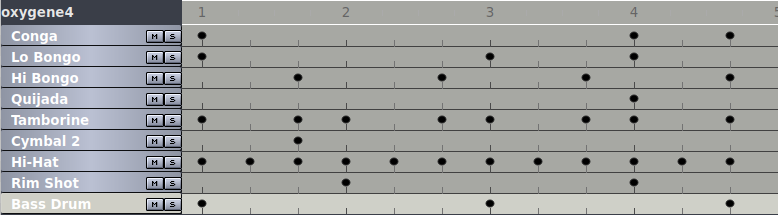

# Keio Korg Minipops 7

An analogue preset drum machine released in 1966. There are 15 voices, produced by tuned-oscillator inductor-based circuits. There are 20 preset rhythms, which can combined by pressing more than one selector button. The quijada, guiro, and tamborine have their own volume controls. There is also a 'balance' control (not sure what that does).

## As heard on...

[Jean-Michel Jarre](https://en.wikipedia.org/wiki/Jean-Michel_Jarre)
has used the Minipops 7 ([1][1], [2][2]). In [Oxygene](https://en.wikipedia.org/wiki/Oxyg%C3%A8ne)
, part 4, he uses the Beguine / Slow Rock combination with Quijada and Tamborine ([1][1]). It's a one-bar pattern, with triplet timing:

## In the repository

The [Electronic Voices](https://github.com/ajwills72/electronic-voices) repository contains drum hit samples for the Minipops 7, plus MIDI and H2 files for the Oxygene 4 pattern.

## Other links

- Drum hit samples for this page came from [KB's Drumsamples](https://samples.kb6.de/downloads.php)

- PDF of [user manual](https://www.korg.com/us/support/download/manual/1/402/4020/) at Korg USA.

- Hi-res images, and some videos at [Audio Fanzine](https://en.audiofanzine.com/drum-machine/korg/mini-pops-7/).

- Demo video by [Alba Ectasy](https://discchord.com/blog/2016/9/29/korg-keio-minipops-7.html).

- Kevin Schroder demonstrates the Oxygene 4 patterb @0:54 in his [youtube video](https://www.youtube.com/watch?v=i11OZGCMoCo).

- Proprietary sample pack (RX2) by [Dubsounds](http://www.dubsounds.com/mp7.htm).

- Proprietary emulation (Konkat) [Oxypops](https://www.kontakthub.com/product/oxypops-kontakt-drum-machine/) by Forgotten Keys.

[1]: https://reedgors.home.xs4all.nl/64/spul_e.htm
[2]: http://aerozonejmj.fr/korg-mini-pops-7/#more-9282
